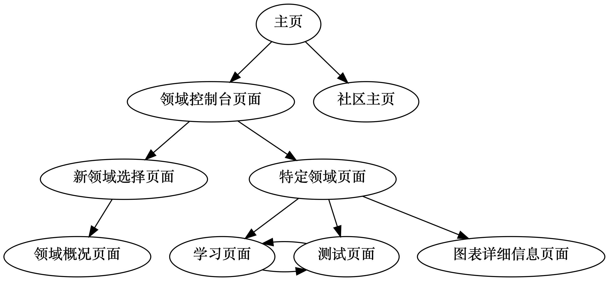

## 分页面规范

### 页面跳转流程图




### 菜单栏

“学习”, “社区”以及"用户"三栏，点击分别进入领域控制台页面`/domain/dashboard.html`, 社区主页`/community/index.html`以及用户信息页面`/user.html`. 菜单栏在所有页面的顶部（web端）或底部（移动端）显示.


### 主页

```yaml
name: index
url: /index.html
priority: -1
```

- 功能描述：用户登陆后进入的主页面.
- 内容：
    1. 若用户尚无可用的学习领域（通常出现在用户刚刚注册完成，或者所有领域都已经学习完成的情况），显示“选择新领域”按钮，点击跳转到新领域选择页面`/domain/select`, 否则显示用户最近正在学习的几个领域. 点击继续上一次退出时正在进行的学习材料页面`/domain/[domain_name]/learn/[learn_id].html`或测试材料页面`/domain/[domain_name]/test/[test_id].html`.
    2. 个人信息流（包括日/周/月/年学习数据报表生成通知、提交学习材料同行评审进度、社区主题回复提醒等等）. 点击信息流中的特定条目则跳转到相应的页面.


### 领域控制台页面

```yaml
name: domain_dashboard
url: /domain/dashboard.html
priority: +35
```

- 功能描述：显示的当前正在学习的领域及其简单数据.
- 内容：
    1. 当前正在学习领域的一个列表，先分为多个大类(证书获取，程序设计等)，然后每个大类下用多种颜色填充的醒目方块(如下图所示)给出领域名称、领域完成度，点击对应的方块即可进入相应的特定领域页面`/domain/[domain_name].html`. 只显示用户当前正在学习的领域.
    2. “学习新领域”按钮，点击进入新领域选择页面`/domain/select`.
    3. 已完成领域展示，展示用户已经完成的所有领域，点击对应的方块也可进入相应的领域页面`/domain/[domain_name].html`


### 新领域选择页面

```yaml
name: domain_select
url: /domain/select
priority: +20
```

- 功能描述：选择新的学习领域.
- 内容：
    1. 可供选择新领域的一个列表，列出领域的简要介绍、正在学习人数与学习材料数量. 首先列出领域所属的大类(证书获取，程序设计等)，然后选择某大类后再展开该大类中具体的各种领域.点击某个领域进入到领域该概况页面`/domain/[domain_name]/intro.html`.领域仍然用上文所给的方块的形式展示.
    2. 领域搜索框，根据关键词等条件搜索感兴趣的页面.早期领域较少时可不设置此搜索框.


### 领域概况页面

```yaml
name: domain_intro
url: /domain/[domain_name]/intro.html
priority: +15
```

- 功能描述：显示特定领域的介绍.
- 内容：
    1. 特定领域的情况介绍文本，以及将在本课程中将学习到的主要知识点.
    2. 该领域的学习人数，完成人数，与学习材料数量等数据. 
    3. "开始学习”按钮，点击弹出确认框，确认后进入领域知识覆盖性测试流程.“学习流程”按钮，点击弹出领域知识点学习/测试路径树，为用户展示该领域的知识概况.


### 特定领域页面

```yaml
name: domain
url: /domain/[domain_name].html
priority: +30
```

- 功能描述：特定领域的控制台. 显示用户在特定领域的详细数据.
- 内容：
    1. “下一步”按钮. 根据模型推荐的最优化学习路径，点击进入用户下一步应当进行的学习材料页面`/domain/[domain_name]/learn/[learn_id]`或测试材料页面`/domain/[domain_name]/test/[test_id].html`.
    2. 学习/测试路径树，包括已完成的部分和未完成的部分，点击树中的某一个结点可以进入这个结点所对应的的学习材料页面`/domain/[domain_name]/learn/[learn_id]`或测试材料页面`/domain/[domain_name]/test/[test_id].html`. 禁止进入尚未到达的学习或测试页面.
    3. 关于学习进度的各类统计图表，每个图表作为一个独立方块占据页面的一个部分. 点击可进入相应的图表详细信息页面`/graph/[graph_type]`.


### 学习页面

```yaml
name: learn
url: /domain/[domain_name]/learn/[learn_id].html
priority: +30
```

- 功能描述：学习材料内容显示.
- 内容：
    1. 学习材料显示区域.
    2. 计时器，统计当前内容学习时间、累计学习时间.
    3. “下一步”按钮，点击进入下一个学习材料页面`/domain/[domain_name]/learn/[learn_id]`或测试材料页面`/domain/[domain_name]/test/[test_id].html`.
    4. “提问”按钮，点击可跳转至社区问题创建页面对该知识点进行问题提问.`/community/new_thread.html`
    5. “讨论”按钮，点击可跳转至社区，查看有该知识点标签的讨论串.`/community/t/[thread_id].html`


### 测试页面

```yaml
name: test
url: /domain/[domain_name]/test/[test_id].html
priority: +30
```

- 功能描述：测试内容显示与提交
- 内容：
    1. 测试问题显示区域.
    2. 测试选择、填空或代码上传区域.
    3. 计时器，统计当前测试进行时间、累计学习时间.
    4. “提交”按钮，点击提交答案并进入下一个学习材料或测试材料页面.
    5. 展示正在学习此知识点的人数，与此知识点的完成率.


### 图表详细信息页面

```yaml
name: graph_info
url: /graph/[graph_type]
priority: -1
```

- 功能描述：显示关于学习进度的各类统计图表
- 内容：
    1. “返回”按钮，可返回领域控制台`/domain/dashboard.html`.
    2. 活跃度统计，在日历上用颜色逐渐加深的小三角表示用户在网站的活跃程度，讨论、提问、提供学习素材、学习都可算作活跃行为，并显示用户查看月份的总活跃天数.
    3. 知识点强化建议，根据用户学习某个知识点的难度、与其他知识点的相关性、学习时间、测试分数等数据排出一个列表，向用户提出最有复习价值的知识点建议.
    4. 贡献度统计，用列表按照时间序给出用户对学习平台的贡献度变化过程，如社区发言被赞同，发表学习素材，均可以计算贡献度


### 用户

```yaml
name: user
url: /user.html/[user_id]
priority: 待定
```

- 功能描述：用户的个人信息页面
- 内容：
    1. 显示用户的id、注册时间、完成知识点数、完成课程数、社区发表讨论数、贡献知识点数以及贡献值，提供可以编辑的头像与昵称(不可重复)
    2. 可修改密码
    3. 可进行邮箱验证与手机验证，可修改验证邮箱与手机


### 社区主页

```yaml
name: community
url: /community/index.html
priority: 待定
```

- 功能描述：社区主页
- 内容：
    1. 显示社区中现有的讨论串，标示出该讨论串的作者、标题、发表时间、类型(知识点讨论、杂谈、开发建议等)、赞同数、阅读数.
    2. 提供按时间、赞同数排序功能，可按照类型、知识点、发表时间等进行筛选.
    3. “新讨论”按钮，可发布新的讨论串，跳转到新讨论串页面`/community/new_thread.html`.


### 创建新讨论

```yaml
name: new_thread
url: /community/new_thread.html
priority: 待定
```

- 功能描述：社区创建新讨论串
- 内容：
    1. “取消”按钮，取消讨论串的发布，若取消时已经写了部分内容，则询问用户是否自动保存.
    2. “发布”按钮，发布讨论串.
    3. 标题与内容的编辑.
    4. 类别选择，知识点讨论、杂谈、开发建议等。若通过学习页面`/domain/[domain_name]/learn/[learn_id]`跳转至此，则提前用知识点讨论类型与具体的知识点填充类别项；通过社区首页跳转至此，则只能选择其他类别.`/community/index.html`


### 讨论

```yaml
name: thread
url: /community/t/[thread_id].html
priority: 待定
```

- 功能描述：社区讨论串展示，可进行回复与赞同
- 内容：
    1. 每一层均提供类似reddit的赞、踩按钮，如右图所示 
    2. 可按照赞同数或时间顺序进行排序
    3. “回复”按钮，与回复内容编辑框